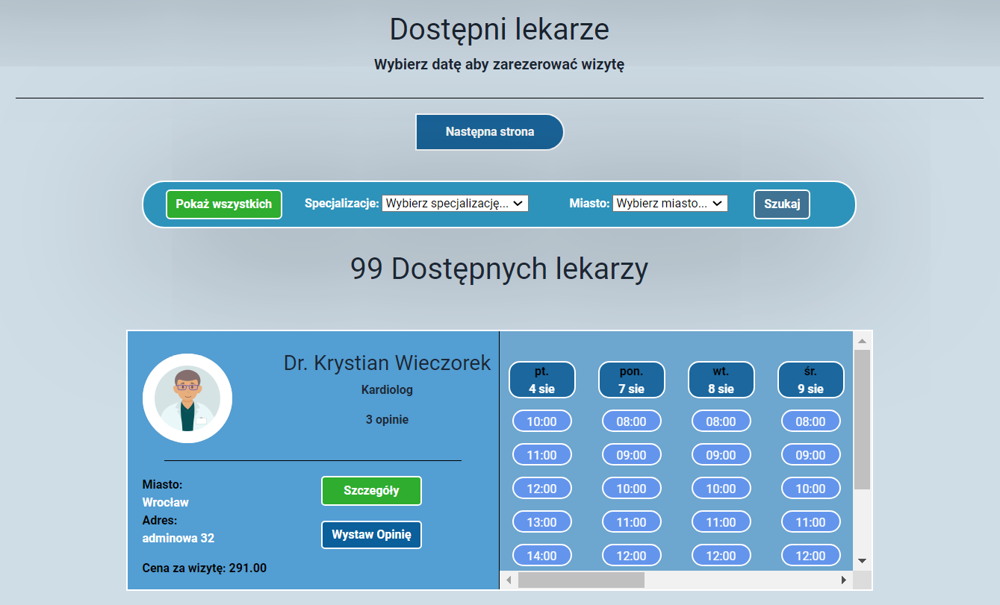

Medinet - Aplikacja do Umawiania Wizyt

Medinet to aplikacja umożliwiająca łatwe umawianie wizyt u specjalistów z różnych miast Polski. Dzięki Medinet użytkownicy mogą szybko znaleźć i zarezerwować termin wizyty u lekarza, dentysty, fizjoterapeuty czy innego specjalisty medycznego.

Funkcjonalności:

1. Przeglądanie dostępnych specjalistów: Użytkownicy mogą przeglądać listę specjalistów z różnych miast Polski, wybierając interesującą ich dziedzinę medycyny.
2. System oferuję paginacje strony dzięki czemu na jednej stronie wyświetlanych jest 15 lekarzy, na nastęne strony przechodzimy korzystając z przycisków
3. Wyszukiwanie specjalistów: Umożliwia szybkie wyszukanie konkretnego specjalisty po dziedzinie medycyny oraz mieście.
4. Rezerwacja wizyty: Po znalezieniu odpowiedniego specjalisty, użytkownik może dokonać rezerwacji wizyty, wybierając dogodny termin.
   Przy czym terminy są dostęne na 2 tygodnie do przodu, nie wliczająć weekendu. Wystarczy kliknąć w wybraną godzinę w danym dniu, po akceptacji wizyty, wolny termin zostanie usunięty lekarzowi i zarówno lekarz jak i pacjent będą mogli anulować wizytę dopóki się jeszcze nie odbyła

5. Wystawienie opinii lekarzowi - Pacjent ma możliwość wystawienia opinii lekarzaowi która będzie widoczna na jego profilu po kliknięciu w przycisk szczegóły
 
 
6. Pacjent może pobrać fakture z wizyty która się odbyła. Aby to zrobić należy zrobić poniższe kroki:
   - Wybieramy interesujący nas termin: Wizyty są dostępne na dwa tygodnie do przodu nie licząc weekendu, od godziny 8 do 15 - takie są zasady zatrudniania specjalistów w Medinet. Logika programu zakłada że rezerwować wizytę można zawsze na conajmniej następny dzień natomiast żeby umożliwić przetestowanie wszystkich możliwości, dodany jest również dzień dzisiejszy.
   - Lekarz ma możliwość wypisania recepty lub notatki do wizyty tylko takiej która już się odbyła oraz ma na to 24 godziny, po tym czasie jeśli nic nie napisze, wizyta otrzymuje status zakończonej.
   - Dlatego w celu testu wybieramy godzine oraz date która już minęła np jeśli godzina testowania to czwartek 27 lipca godzina 17;00 to wybieramy termin wizyty czwartek 27 lipca godzina 10 rano - chodzi o to zebyśmy nie musieli czekać kilka dni na wizyte żeby lekarz mógł wystawić opinie, docelowo najbliższy termin jaki możemy zarezerwować to zawsze następny dzień roboczy. 
 - Po zarezerwowaniu wizyty, przechodzimy na profil specjalisty, w tym celu klikamy w szczegóły lekarza u którego zarezerwowalismy wizyte i kopiujemy jego adress email, klikamy przycisk wyloguj i logujemy sie na profil lekarza skopiowanym emailem, hasło dla każdego specjalisty to: test
   , następnie klikamy w przycisk "Do zatwierdzenia" - program działa tak że sprawdza co godzinę czy wizyta się odbyła to znaczy czy ma status pendning i oczekuje na notatke od lekarza, natomiast w celu testowania aplikacji, program robi to co 20 sekund
   

   - wystawiamy zalecenia lub recepte i zatwierdzamy
   
  
     
- Wizyta w tym momencie ma status zakończonej, można ją sprawdzić klkając w przycisk "Zakończone"
- Wylogowujemy się i wracamy do konta które rezerwowało wizytę, wchodzimy na "moje konto"
- W tym momencie mamy możliwość pobrania faktury za wizyte, wystawianej przez zewnętrzne api ze strony htmlpdfapi.com .
- W przypadku uruchamiania programu przez intelij faktura zostanie pobrana do folderu src/main/resources/invoices
- W przypadku uruchamiania przez Docker plik zostanie pobrany do ścieżki /usr/src/app/invoices/
- W obu przypadkach status pobrania i  ścieżka zostanie wyświetlona w logach apliakcji w terminalu
- Po pobraniu faktury do kontenera Dockera możemy pobrać ją do folderu z aplikacją komendą
 docker cp <id kontenera>:<ścieżka z logów i nazwa faktury> ./
np: docker cp b298f7c480ac4f552779b2fec7393309d2d5baf1000a5f046513b2f3ec16ef53:/usr/src/app/invoices/faktura_medinet912c18b7-d558-4e49-9c45-64bc9a4a3186.pdf ./
- Jeżeli z jakiegoś powodu nr faktury nie jest logowany w terminalu to można wejść w moje konto i skopiować nr UUID z daje faktury
- Jest to darmowe api i pozwala na  100 darmowych wywołań więc w przypadku poniższego błędu należy dostarczyć nowy token

6. Rezerwacja w serwisie:
   - użytkownik może się zarejestrować przy czym program waliduje dane wejściowe
     

7 Odzyskiwanie hasła:
  - użytkownik ma  możliwość odzyskania hasła o ile email istnieje w bazie danych oraz nie należy on do lekarza. Liczba lekarzy w serwisie jest z góry określona i nie można ich dodawać ale można logować się na ich konta.
  - Mechanizm działa w taki sposób, że jeżeli adres email istnieje w bazie danych to wysyłane jest na ten adres wygenerowane przez system hasło, przy którym można zostać lub zmienić je w zakładce Moje konto

Uruchamianie

Program przeznaczony jest do uruchamiania w środowisku Docker. W tym celu należy pobrać repozytorium w formacie zip, wypakować, otworzyć terminal 
przechodzimy do folderu z aplikacją, następnie wykonujemy polecenie docker build -t medinet .
Teraz mając obraz aplikacji, należy uruchomić kontener docker compose up -d
Można włączyć logi aplikacji komendą docker logs medinet_app-master-backend-1
W przeglądarce wejść na adres http://localhost:8190/medinet/
